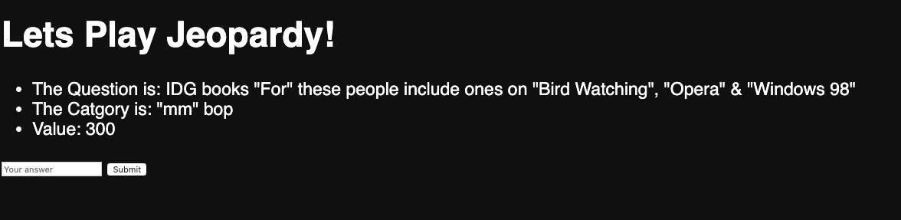
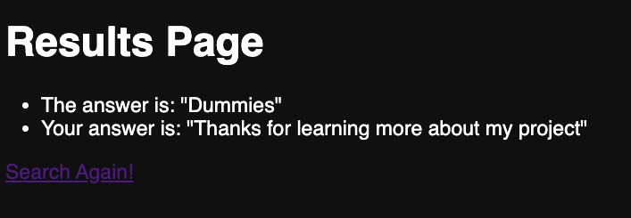

# JeopardyNodeJS Appllication
A nodejs web application that allows users to play endless hours of jeapordy. Uses the http://jservice.io/ API

# Motivation
An attempt to improve my web developments skills and learn how to use server frameworks for Nodejs.

#Thing I learnt from this project
- JSON files
- NodeJS
- Express
- ejs
- APIs and implementation

# Build Status
A basic implementation has been completed. 
Things to do:
- Improve styling
- Score keeper

# Screenshots

# Tech
**Built With**
- HTML
- CSS
- JavaScript
- NodeJs

# How to run
Note: npm needs to be installed on your machine
- cd into jeopardyapp
- run npm install (download dependecies)
- run node app.js
- go to local host 3000 on browser

**Dependencies**
- ejs: ^3.0.1
- express:^4.17.1
- request: ^2.88.0

# License
MIT © Benjamin De Vierno
